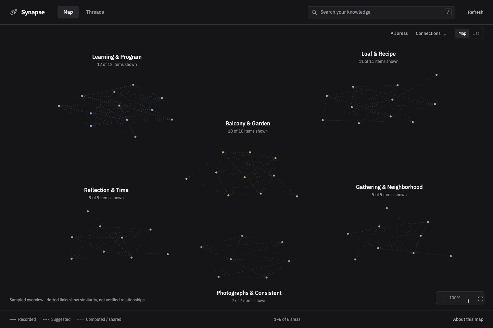
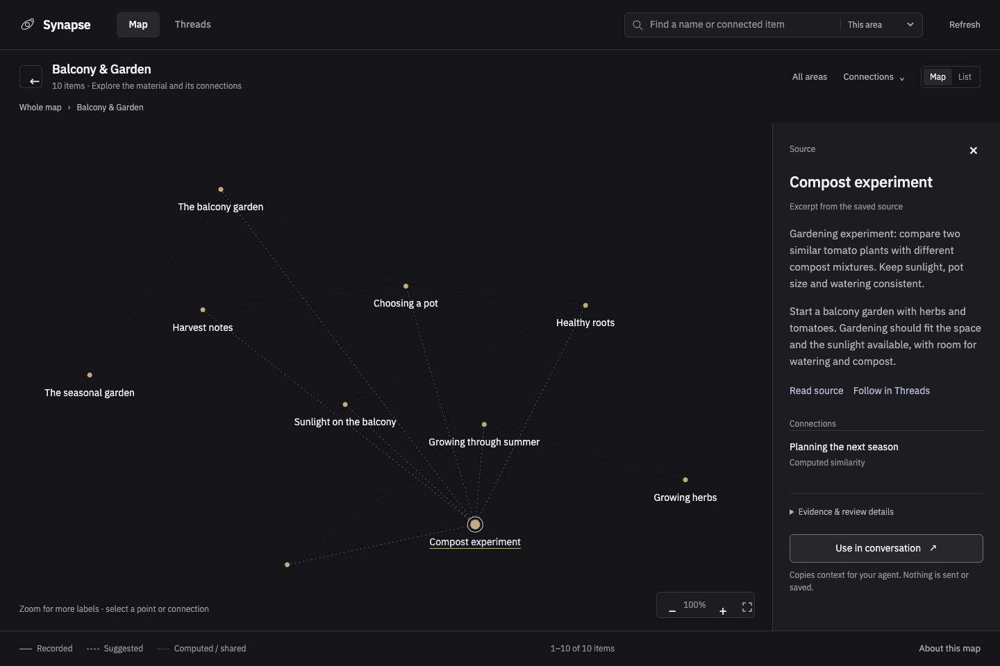

# Digital Synapse

**A personal knowledge workspace for you and your AI agents.**

Bring together your notes, ideas, projects and selected documents. Ask agents to connect the dots, explore your knowledge through an interactive map, and trace answers back to their sources.

**Free and open source · Mac and Codex first · [v2 Alpha 1](https://github.com/ranakun/Digital-Synapse/releases/tag/v2.0.0-alpha.1)**

[Set up with your agent](#start-with-your-agent) · [Explore the map](#talk-to-your-agent-explore-with-the-map)



*The actual Synapse viewer, using fictional example data. Groups are computed from the material; dotted links show similarity, not verified relationships. [About these images](docs/media/README.md).*

## Start with your agent

Give a Codex agent this request. It can clone the repository and do the technical setup for you:

```text
Set up https://github.com/ranakun/Digital-Synapse for me on this Mac.
Read AGENTS.md and follow SETUP.md. Handle the technical steps and explain
my choices in plain language. Keep my knowledge separate from the public
repository, start empty or with only the material I select, and show me
how to ask a question and open the map.
```

You need Codex installed and signed in, with access to its agent and CLI capabilities. Your own Codex access is separate from this free software. Sign-in and system permission prompts remain your actions. You do not need to edit Markdown, manage servers in terminals or configure Python yourself.

**Start small.** A few notes about something you are learning, building or deciding are enough. A contact import or a complete life history is optional. [The agent's setup walkthrough →](SETUP.md)

## What could you use it for?

| Bring your context | Ask your agent |
| --- | --- |
| Learning notes, ideas and current projects | “Which ideas could help with what I'm building? What could I try next?” |
| People, past conversations and plans | “Who might help me think through this decision, and what in my notes makes them relevant?” |
| Goals, reflections and earlier decisions | “Where does this plan conflict with my priorities? What assumptions should I question?” |

These are example questions, not promised outcomes. Useful answers depend on the information you have saved. The specialist searches and follows relationships, checks sources, and distinguishes evidence from inference or missing context. You keep the final decision.

## Talk to your agent. Explore with the map.

**Chat is the working interface.** Ask questions, explicitly save a thought or document, request a deeper investigation, or correct earlier understanding. A temporary Synapse specialist retrieves context for the agent you're already working with. Nothing starts investigating simply because a note was saved.

**The map is for you.** Explore computed groups, zoom into their notes and connections, search within an area or across your knowledge, and open the original material. The viewer includes a source inspector and a way to copy selected context back to your agent. Large collections use bounded views with visible counts; new or sparse collections may not have clusters yet.



*Select a point to inspect the saved material. The example is fictional; the interface and interactions are real.*

## Your information, with its context intact

- **Save deliberately.** Ordinary conversations are not automatically saved. Choose what to retain; original material can be available even while its interpretation is incomplete.
- **Keep uncertainty visible.** An agent's suggestion can be useful before review without becoming your belief, a verified fact or a commitment.
- **Review briefly.** Consequential proposed changes come with a concise explanation. Sources and previous revisions remain inspectable.
- **Own the workspace.** Sources and Markdown revisions are durable; indexes and map layouts can be rebuilt. The installation includes backup and restore tools.

Your knowledge lives in a separate local workspace. Agent reasoning uses Codex, so local storage does **not** mean all AI processing happens offline. Do not publish your personal vault in this public repository.

## What to expect from this alpha

The supported path is **one person, macOS and Codex**. Other agents can adapt the documented interfaces, but other hosts and Windows are not certified. Consultation uses native delegation; some preparation and review still use the Codex CLI. Search and grouping are heuristic, and the system cannot guarantee every useful connection will be found.

The release passed **1,087 automated tests**, package checks and native-agent trials. An intermittent hosted-CI viewer-startup timeout remains documented. Dedicated security hardening and stronger safeguards against accidental public-vault publication are future work. See [release status and limitations](docs/HANDOFF.md) and the [roadmap](docs/BUILD.md).

## Why this exists

Useful context is often scattered across notes, documents and conversations. Digital Synapse brings that context together so people and agents can reason across it while keeping the evidence and the person's judgment in view.

The project shares both the tools and the working methods: how to retain sources, investigate connections, handle uncertainty and review changes. They are open for others to use, understand and adapt to their own lives.

## Go deeper

- [Guided setup and returning to your workspace](SETUP.md)
- [Specialist role and agent integration](integrations/synapse/README.md)
- [Architecture and contracts](docs/ARCHITECTURE.md)
- [Migrating a public v1 workspace](docs/MIGRATION.md)
- [Trial evidence](docs/TRIAL-RESULTS.md) · [Contributing](CONTRIBUTING.md)

Questions, confusing behavior or useful improvements? [Open an issue](https://github.com/ranakun/Digital-Synapse/issues) with a synthetic example; keep personal knowledge and credentials out of public reports.

Licensed under [Apache-2.0](LICENSE). Bundled assets retain their own notices.
